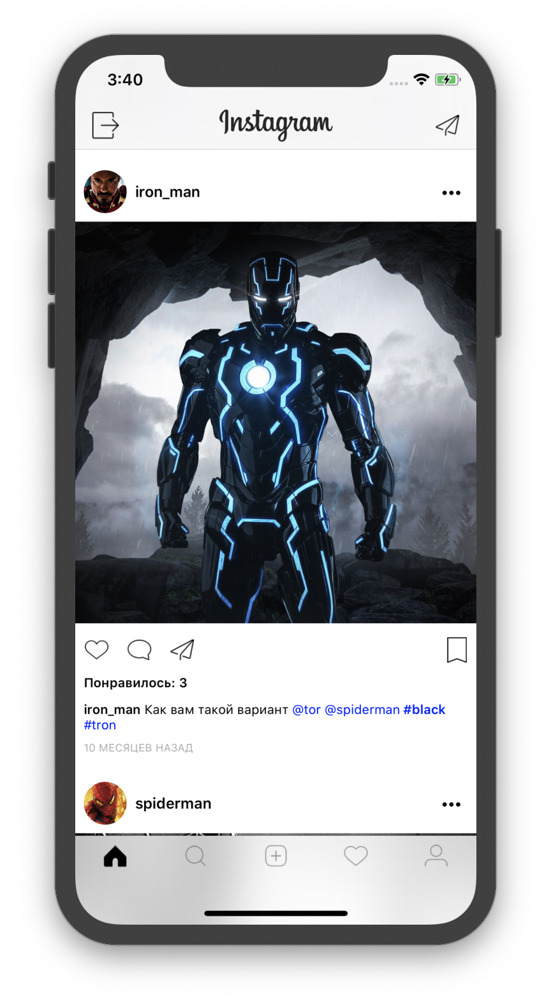
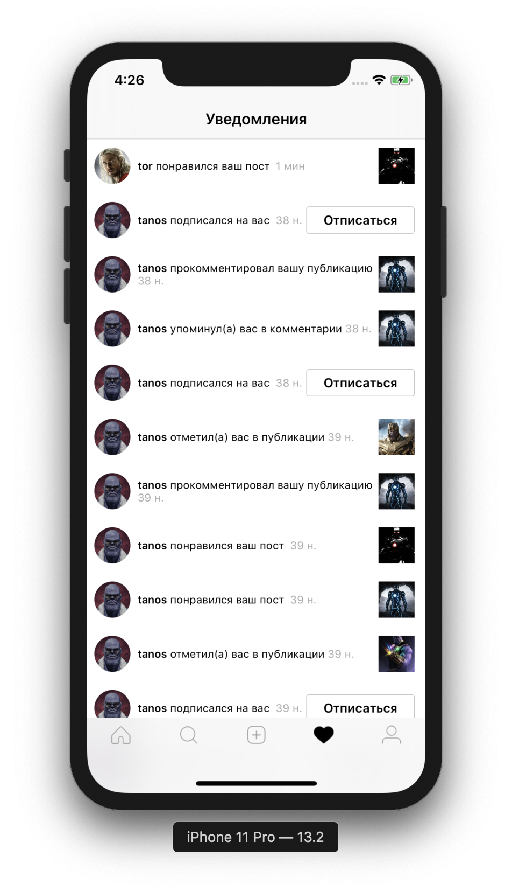
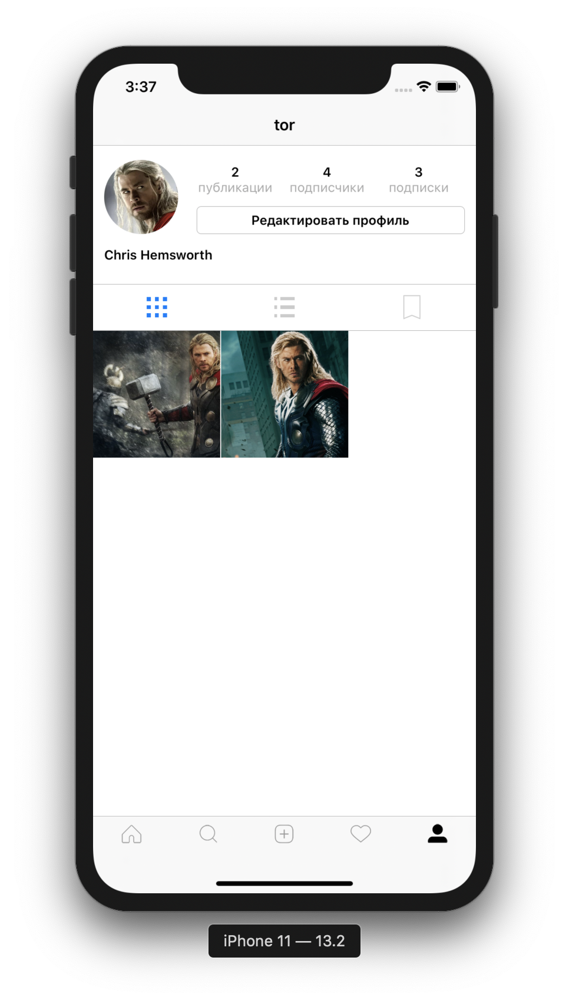

#  Учебный проект целью которого являлась разработка приложения похожего по функционалу на Instagram, который работает на БД Firebase.

Данное приложение разработанно в рамках самообучения программированию на языке Swift.
Разработанное приложение повторяет основной функционал известного притложения Instagram. 

Все экраны реализованы без использования Storyboards.

#  Функционал приложения

##  Авторизация и регистрация

Приложение начинается с экрана авторизации, где пользователю необходимо ввести свой логин и пароль.

 
 

Если у пользователя нету аккаунта, то он имеет возможность зарегестрироваться, заполнив необходимые поля формы регистрации.

 
 

##  Лента пользователя

Лента пользователя представляет публикации пользователей на которых подписан текущий пользователь. Публикации можно лайкать и оставлять под ними комментарии. Так же хочется отметить, что публикации загружаются по 5 постов, остальные подгружаются по мере необходимости.

 
 

Так же при публикации нового поста, пользователь может упомянуть пользователя указав его имя в формате **@username**, тогда упомянутый пользователь получит соответствубщее уведомление об этом на экране уведомлений. Так же при публикации поста, можно указать **хэштег** для него.

 
 

Оставляя комментарий под постом так же можно упомянуть пользователя, чтобы он получил уведомление об этом.

 
 

##  Поиск

По умолчанию приложение отображает страницу на которой отобрадаются все опубликованные изображения всеми пользователями.

 
 

Если нажать на строку поиска, то отобразится экран поиска по всем пользотвателям зарегестрированным в приложении.

 
 

##  Публикация изображения

Пользователь выбирает изображение из его фотогалереи. Затем добавляет к нему описание и публикует.

 
 

##  Центр уведомлений

Если пользователь зашел в приложение и у него есть непрочитанные уведомлений то это оповестит соответствующий индикатор.

 
 

Как можно заметить уведолмения бывают разных типов. Если пользователь на нас подписался, но рядом с уведомлением будет кнопка подписаться на этого пользовтаеля, если мы на него уже подписаны, то будет кнопка отписаться. Так же уведолмения об упоминании пользователя, о том что кто-либо лайкнул какую-либо публикацию так же присутствуют.

 
 

##  Экран профиля

Тут по традиции представлена краткая информация о пользователе и его публикациях. 

 
 

Так же можно посмотреть его подписки и подписчиков имея возможность подписаться на пользователя или отписаться.

 
 

##  Экран сообщений

В приложении есть возможность переписываться с пользователями которые подписаны на текущего пользователя. Сообщения сортируются по новизне. Чтобы написать пользователю нужно выбрать соответствующий диалог или нажать **+** и выбрать пользователя чтобы начать диалоог.

 
 

Экран переписки выглядит следующим образом.

 
 

